# CHAPTER THREE
# METHODOLOGY AND SYSTEM DESIGN

## 3.1 Chapter Overview

This chapter presents the methodology, system design, and architectural decisions behind the development of the web-based Internship Management System (IMS) for the Regional Maritime University (RMU). It covers the research and development methodology, the requirements gathering process, functional and non-functional requirements, UML modelling (use case diagrams with descriptions, activity diagrams, sequence diagrams, and class diagrams), security design, logical design of the user interface and database, and the development tools and technologies used.

## 3.2 Requirement Specification

The requirements specification phase was essential to making sure the IMS addresses the real needs of all stakeholder groups. Through a careful analysis of the existing manual internship management process at RMU, both functional and non-functional requirements were identified and documented.

### 3.2.1 Stakeholders of the System

The IMS serves five primary stakeholder groups, each with distinct roles and expectations:

**Students:** The main end-users of the system. Students can browse internship opportunities posted by administrators, request introduction and placement letters, track the status of their letter requests, register official placements, complete weekly log sheet books, receive supervisor evaluations, and get automated email and in-app notifications throughout the internship lifecycle.

**Administrators (University Staff / Internship Coordinators):** University personnel responsible for overseeing the entire internship programme. They manage user accounts (including creating staff accounts), post and manage internship listings, review and approve or reject student letter requests, generate official PDF letters with digital signatures, manage notices and announcements, track official placements, send evaluation forms to company supervisors, review weekly logbooks, view analytics, and monitor security logs.

**Head of Department (HoD):** Department heads who access a dedicated portal to oversee internship activities within their department. They can review letter requests and official placements, approve or reject weekly logbooks, manage their digital signature, view department-specific evaluations, and monitor students by course. Staff accounts are created by the Administrator with a temporary password; on first login, staff must change their password.

**Secretary:** Departmental secretaries who share the same access privileges as the HoD. They can view department-specific letter requests, evaluations, placements, and logbook records, serving as an administrative support role within the department.

**Company Supervisors (External Evaluators):** Industry partners who supervise students during their internship placement. They receive token links via email for two purposes: (1) evaluation forms to rate students on criteria such as work ethic, communication, technical skills, teamwork, punctuality, and problem-solving, and (2) weekly logbook review forms to provide supervisor remarks and recommendations. They do not need to create an account to access these forms.

**Figure 3.1:** Stakeholder Interaction Diagram of the IMS
*(Show the five stakeholder groups and their interactions with the system)*

### 3.2.2 Requirement Gathering Process

A mixed-methods approach was used for requirements gathering to ensure comprehensive stakeholder coverage. The following techniques were employed:

**Structured Interviews:** Semi-structured interviews were conducted with key staff members from the Department of ICT, including the internship coordinator, to document existing workflows, pain points, and expectations for the new system.

**Questionnaire Surveys:** A structured questionnaire was given to a sample of students and company representatives who had previously taken part in RMU's internship programme. This assessed satisfaction levels with the current process and gathered feature preferences.

**Direct Observation:** The existing manual workflow was observed over a two-week period, tracking the lifecycle of a sample internship request from initial letter to placement completion.

**Document Analysis:** Existing paper forms, email templates, and spreadsheets used in the current internship process were analyzed to ensure the new system would digitize and improve every touchpoint [3].

These techniques ensured that the system requirements were grounded in real institutional needs rather than theoretical assumptions. Pressman notes that requirements engineering is the most critical phase of software development, as errors introduced at this stage propagate through and amplify across all later phases [4].

### 3.2.3 Functional Requirements

The functional requirements define the specific behaviors and capabilities the system must exhibit for each user role.

**Student Module:**
| ID | Requirement | Description |
|----|-------------|-------------|
| FR-S01 | User Registration | Students can register with their RMU email (@st.rmu.edu.gh), name, student ID, department, programme, and level |
| FR-S02 | Email Verification | Students verify their email via a 6-digit code or verification link sent to their inbox |
| FR-S03 | Login/Logout | Students can log in with email and password and log out securely |
| FR-S04 | Browse Internships | Students can browse a searchable, filterable catalogue of active internship postings |
| FR-S05 | Request Introduction Letter (Stage 1) | Students can request a general introduction letter; once approved, a PDF is generated with the HoD's digital signature |
| FR-S06 | Register Official Placement (Stage 2) | After obtaining an introduction letter, students register their official placement with company details (organization name, supervisor email, dates) |
| FR-S07 | Weekly Log Sheet Book | Students can create, edit, and submit weekly log entries documenting their internship activities; finalize and send to supervisor for review |
| FR-S08 | View Evaluations | Students can view and acknowledge evaluations submitted by their company supervisors |
| FR-S09 | View Notices | Students can read announcements posted by administrators |
| FR-S10 | View Notifications | Students receive in-app notifications for key events (letter decisions, evaluations, logbook feedback, etc.) |
| FR-S11 | Download PDF Letter | Students can download approved introduction and official placement letters as PDFs |

**Administrator Module:**
| ID | Requirement | Description |
|----|-------------|-------------|
| FR-A01 | Dashboard | View real-time KPIs including total users, placements, pending requests, and key figures |
| FR-A02 | User Management | Create staff accounts (HoD, Secretary) with temporary passwords; activate, deactivate, and delete user accounts |
| FR-A03 | Internship Management | Create, edit, publish, and close internship postings with full details (title, company, location, type, duration, requirements, responsibilities, stipend, deadline, slots) |
| FR-A04 | Letter Request Management | Review, approve, or reject student letter requests with admin notes |
| FR-A05 | PDF Letter Generation | Generate official internship letters as formatted PDF documents with the RMU crest, digital signatures, reference numbers, and verification codes |
| FR-A06 | Placement Management | Track official placements, send placement letters to organizations via email, and manage the placement workflow |
| FR-A07 | Evaluation Management | Create evaluations, send token-based evaluation links to company supervisors via email, and view completed evaluations |
| FR-A08 | Weekly Logbook Review | View and monitor weekly logbook submissions from students across all departments |
| FR-A09 | Notice Board | Post and manage announcements visible to students with priority levels and expiry dates |
| FR-A10 | Analytics | View interactive charts showing placement trends and departmental data |
| FR-A11 | Security Logs | View audit trail of security events, unauthorized access attempts, and rate limit violations |
| FR-A12 | Notifications | Send and manage system notifications to users |

**Head of Department (HoD) / Secretary Module:**
| ID | Requirement | Description |
|----|-------------|-------------|
| FR-H01 | Staff Login | Authenticate via admin-created credentials; force password change on first login |
| FR-H02 | Department Dashboard | View internship activities and key figures scoped to their specific department |
| FR-H03 | Review Letter Requests | Review and approve/reject letter requests from students within their department |
| FR-H04 | Review Official Placements | Monitor and review placement records for their department's students |
| FR-H05 | Approve Weekly Logbooks | Review weekly logbook submissions from department students; approve or reject with remarks |
| FR-H06 | Manage Digital Signature | Upload and manage their department digital signature for use on official letters |
| FR-H07 | View Evaluations | Access evaluation records for students in their department |
| FR-H08 | View Students by Course | Browse department students filtered by programme/course |

**External Evaluator (Company Supervisor) Module:**
| ID | Requirement | Description |
|----|-------------|-------------|
| FR-E01 | Token-Based Evaluation Access | Access the evaluation form via a unique token link sent by email, with no account registration required |
| FR-E02 | Complete Evaluation | Rate the student on six criteria (work ethic, communication, technical skills, teamwork, punctuality, problem-solving) on a 1-5 scale |
| FR-E03 | Submit Comments | Provide written comments and a final recommendation (Excellent, Good, Satisfactory, Needs Improvement) |
| FR-E04 | Token-Based Logbook Review | Access weekly logbook review form via a separate token link to provide supervisor remarks and recommendations |

## 3.3 UML Diagrams

The Unified Modelling Language (UML) was used to visually model the behavioural and structural aspects of the IMS. The following UML diagrams were developed to capture the key interactions, workflows, and structural relationships within the system [8].

### 3.3.1 Use Case Diagrams

Use Case diagrams capture the functional requirements of the system by showing the interactions between the system's actors and the services the system provides. The diagrams are separated by user role for clarity.

**Use Case Diagram for the Student Module:**
The Student use case diagram shows how students interact with the system. Key use cases include: Register Account (with email verification), Login, Browse Internship Catalogue, Request Introduction Letter (Stage 1), Register Official Placement (Stage 2), Complete Weekly Log Sheet Book, View Notices, View Notifications, View and Acknowledge Evaluations, Download PDF Letters, and Logout.

**Figure 3.2:** Use Case Diagram for the Student Module
*[INSERT USE CASE DIAGRAM – STUDENT MODULE]*

**Use Case Diagram for the Administrator Module:**
The Administrator use case diagram captures the full oversight capabilities. Key use cases include: Login, View Dashboard KPIs, Manage Users (Create Staff Accounts), Post/Manage Internship Listings, Review/Approve/Reject Letter Requests, Generate Official PDF Letters (with Digital Signatures), Manage Official Placements, Send Evaluation Tokens to Supervisors, Review Weekly Logbooks, Post Notices, View Analytics, View Security Logs, Manage Notifications, and Logout.

**Figure 3.3:** Use Case Diagram for the Administrator Module
*[INSERT USE CASE DIAGRAM – ADMINISTRATOR MODULE]*

**Use Case Diagram for the HoD / Secretary Module:**
The HoD / Secretary use case diagram shows how Heads of Department and departmental Secretaries interact with the system. The HoD has additional capabilities including logbook approval and digital signature management. Key use cases include: Login (with Force Password Change on first login), View Department Dashboard, View Department Students by Course, Review Letter Requests, Review Official Placements, Review/Approve Weekly Logbooks, Manage Digital Signature, View Evaluations, View Notifications, and Logout.

**Figure 3.4:** Use Case Diagram for the HoD / Secretary Module
*[INSERT USE CASE DIAGRAM – HoD / SECRETARY MODULE]*

**Use Case Diagram for the External Evaluator:**
The External Evaluator (Company Supervisor) use case diagram shows how supervisors interact with the system solely through token-based access. Company supervisors receive unique links via email for both evaluation forms and weekly logbook reviews, with no system account required.

**Figure 3.5:** Use Case Diagram for the External Evaluator
*[INSERT USE CASE DIAGRAM – EXTERNAL EVALUATOR]*

### 3.3.2 Use Case Descriptions

The following tables provide detailed descriptions of key use cases.

**Table 3.1: Use Case Description - Student Requests Introduction Letter (Stage 1)**
| Field | Description |
|-------|-------------|
| Use Case Name | Request Introduction Letter |
| Actor | Student |
| Precondition | Student is logged in and email is verified |
| Main Flow | 1. Student navigates to the Letter Requests page. 2. System explains the two-stage process with an informational banner. 3. Student clicks "Request Introduction Letter." 4. System creates a general letter request with status "Pending." 5. The HoD or Admin reviews and approves the request. 6. On approval, a PDF letter is generated with the HoD's digital signature, QR code verification, and reference number. 7. Student receives a notification and can download the PDF. |
| Postcondition | Introduction letter is generated and available for download |
| Alternative Flow | If the request is rejected, the student receives a notification with the admin's notes and can resubmit |

**Table 3.2: Use Case Description - Admin Approves Letter Request**
| Field | Description |
|-------|-------------|
| Use Case Name | Approve or Reject Letter Request |
| Actor | Administrator |
| Precondition | Administrator is logged in; a pending letter request exists |
| Main Flow | 1. Admin navigates to the Letter Requests page. 2. System displays all pending requests with student details. 3. Admin clicks on a request to view details. 4. Admin selects "Approve" or "Reject" and enters optional notes. 5. System updates the request status in Supabase. 6. System sends an email notification to the student with the decision. 7. If approved and it is a placement letter, admin can generate an official PDF using PDFKit. |
| Postcondition | Request status is updated and student is notified |

**Table 3.3: Use Case Description - Company Supervisor Submits Evaluation**
| Field | Description |
|-------|-------------|
| Use Case Name | Submit Student Evaluation |
| Actor | Company Supervisor (External Evaluator) |
| Precondition | Supervisor has received a valid evaluation token link via email |
| Main Flow | 1. Supervisor clicks the token link in their email. 2. System loads the evaluation form on the Next.js frontend (no login required). 3. System validates the token and displays student and placement details. 4. Supervisor rates the student on six criteria (1-5 scale each): work ethic, communication, technical skills, teamwork, punctuality, and problem-solving. 5. Supervisor enters written comments and selects a final recommendation. 6. Supervisor clicks "Submit." 7. System stores the evaluation in Supabase and creates a notification for the student. |
| Postcondition | Evaluation is saved and student can view it on their dashboard |

**Table 3.4: Use Case Description - Supervisor Reviews Weekly Logbook**
| Field | Description |
|-------|-------------|
| Use Case Name | Review Weekly Log Sheet Book |
| Actor | Company Supervisor (External Evaluator) |
| Precondition | Supervisor has received a valid logbook review token link via email |
| Main Flow | 1. Supervisor clicks the token link in their email. 2. System loads the logbook review page (no login required). 3. System validates the token and displays all weekly entries. 4. Supervisor reviews daily activities and student remarks. 5. Supervisor enters their full name, remarks, and recommendation. 6. Supervisor submits the review. 7. System stores the review and notifies the HoD for final approval. |
| Postcondition | Supervisor review is saved; logbook status changes to "Supervisor Reviewed"; HoD is notified |

### 3.3.3 Role-Based Flowcharts

The following flowcharts illustrate the step-by-step workflow for each user role, corresponding to the use case diagrams above. Each flowchart shows the sequential and decision-based processes a user follows when interacting with the system.

**Student Workflow Flowchart:**
The Student flowchart shows the complete journey from registration through to logbook finalisation. After registering and verifying their email, the student browses internships, requests an introduction letter (Stage 1), downloads the approved PDF, registers their official placement (Stage 2), completes the weekly log sheet book, and finalises it for supervisor review.

**Figure 3.6:** Student Workflow Flowchart

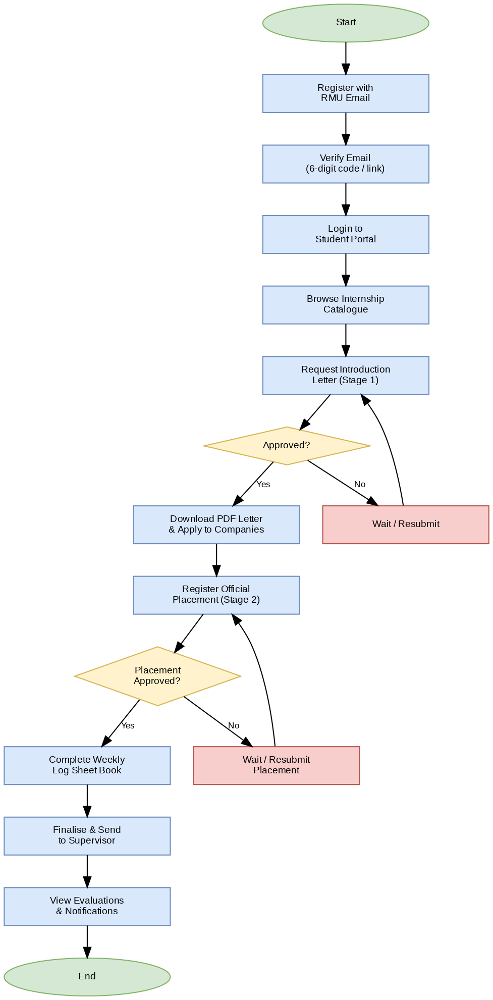

**Administrator Workflow Flowchart:**
The Administrator flowchart shows the oversight workflow including dashboard review, user management, internship posting, letter request approval with PDF generation, placement management, evaluation token dispatch, logbook monitoring, and notice management.

**Figure 3.7:** Administrator Workflow Flowchart

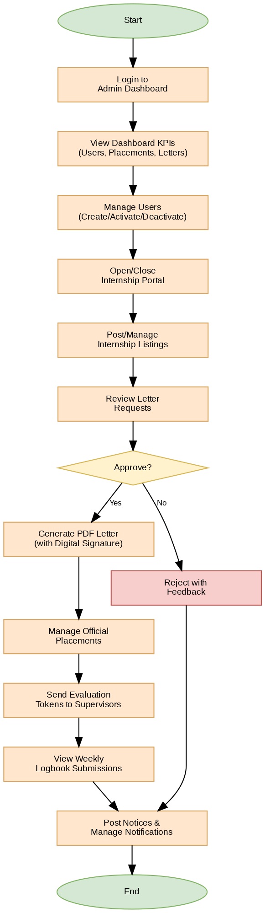

**HoD / Secretary Workflow Flowchart:**
The HoD/Secretary flowchart includes the force password change on first login, department dashboard review, letter request and placement review, weekly logbook approval/rejection, digital signature management, and evaluation viewing.

**Figure 3.8:** HoD / Secretary Workflow Flowchart

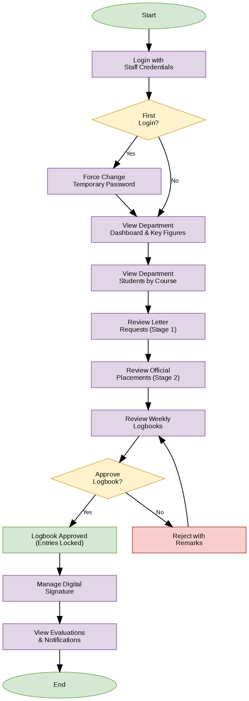

**External Evaluator Workflow Flowchart:**
The External Evaluator flowchart shows the token-based access flow: receiving an email link, token validation, viewing student details, completing the evaluation form, and submitting ratings and comments — all without requiring an account.

**Figure 3.9:** External Evaluator Workflow Flowchart

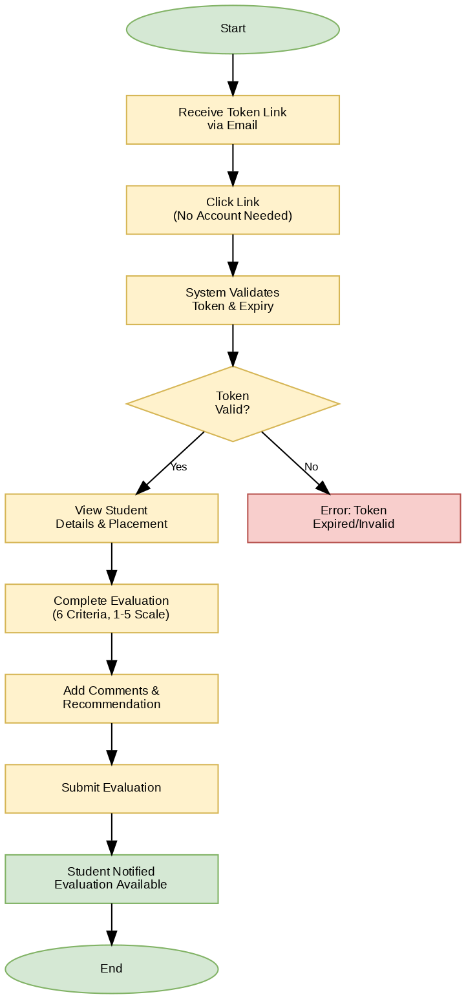

### 3.3.4 Activity Diagrams

Activity diagrams model the dynamic workflow of the system's processes, showing the sequence of activities, decision points, and parallel flows.

**Figure 3.10:** Activity Diagram for the Letter Request and Placement Workflow

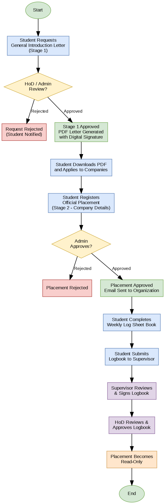

**Figure 3.11:** Activity Diagram for the Weekly Logbook Workflow

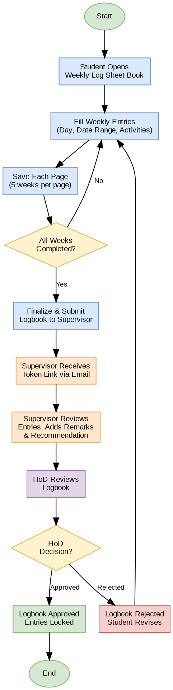

### 3.3.5 Sequence Diagrams

Sequence diagrams show the time-ordered interactions between system objects and actors.

**Figure 3.12:** Sequence Diagram for Letter Request and PDF Generation

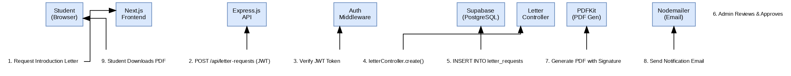

**Figure 3.13:** Sequence Diagram for Supervisor Evaluation via Token Link

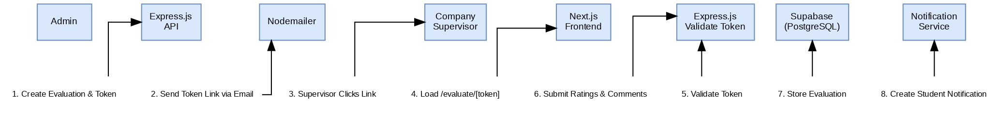

### 3.3.6 Class Diagram

The class diagram represents the static structure of the system, showing the key models (entities), their attributes, and relationships as implemented in the Supabase data layer.

**Figure 3.14:** Entity-Relationship Diagram of the IMS Data Models

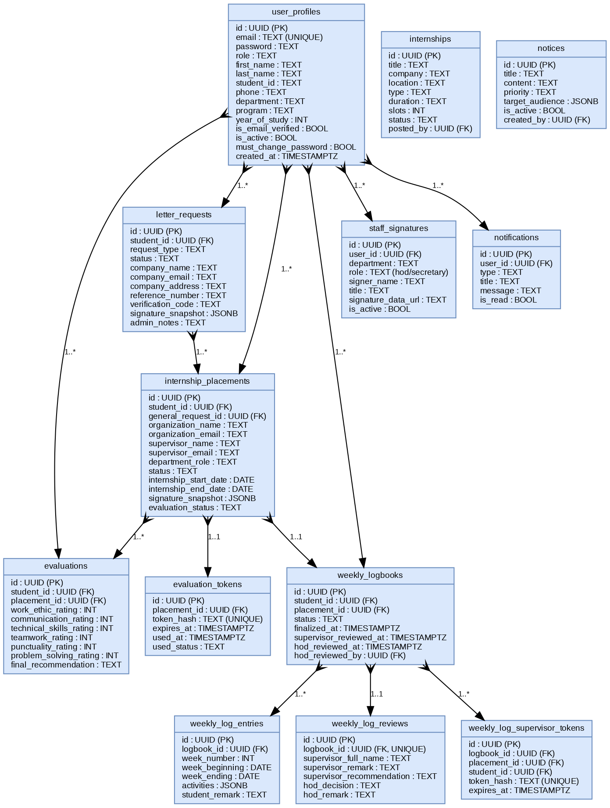

The database schema includes the following key tables:
- **user_profiles** – all user account data with must_change_password flag for staff accounts
- **internships** – internship postings managed by administrators
- **letter_requests** – letter requests with signature_snapshot (JSONB) for preserving the signing HoD's signature
- **internship_placements** – official placements with supervisor_email, signature_snapshot, and evaluation tracking
- **evaluations** – supervisor evaluation ratings and comments
- **evaluation_tokens** – token-based evaluation access (hashed tokens, expiry dates)
- **weekly_logbooks** – one logbook per student per placement (status: draft, ongoing, submitted_final, supervisor_reviewed, hod_approved, rejected)
- **weekly_log_entries** – weekly entries within a logbook (activities stored as JSONB)
- **weekly_log_reviews** – supervisor and HoD review records (linked 1:1 to logbook)
- **weekly_log_supervisor_tokens** – token access for external supervisor logbook review
- **staff_signatures** – digital signatures for HoD/Secretary (role-based, department-scoped)
- **notices** – announcements with target_audience and priority levels
- **notifications** – user notifications with type-based categorisation

*Key Relationships: User 1--* LetterRequest, User 1--* InternshipPlacement, User 1--* Evaluation, Evaluation 1--1 EvaluationToken, InternshipPlacement 1--1 WeeklyLogbook, WeeklyLogbook 1--* WeeklyLogEntries, WeeklyLogbook 1--1 WeeklyLogReview, User 1--* StaffSignature, User 1--* Notice (created by), User 1--* Notification*

## 3.4 Non-Functional Requirements

**Table 3.4: Non-Functional Requirements**
| ID | Category | Requirement | Target |
|----|----------|-------------|--------|
| NFR-01 | Performance | API response time under normal load | Less than 2 seconds |
| NFR-02 | Performance | System should handle at least 100 concurrent users | Without degradation |
| NFR-03 | Security | All passwords must be hashed | bcryptjs with 10 salt rounds |
| NFR-04 | Security | All API endpoints must use JWT authentication | Bearer token in Authorization header |
| NFR-05 | Security | Rate limiting on all API routes | 100 requests per 15 minutes (general), 5 requests per 15 minutes (sensitive) |
| NFR-06 | Usability | The UI must be responsive across devices | Desktop, tablet, and mobile |
| NFR-07 | Usability | SUS score from UAT | Target of 70 or above |
| NFR-08 | Reliability | System uptime | 99% availability |
| NFR-09 | Scalability | Database should support growing user base | Supabase managed PostgreSQL with auto-scaling |
| NFR-10 | Compatibility | Cross-browser support | Chrome, Firefox, Safari, Edge |

## 3.5 Security Concepts

Security was treated as a core concern throughout the system design. The following multi-layered security measures were put in place:

**Authentication (JWT + bcryptjs):** Passwords are hashed using bcryptjs with 10 salt rounds before storage. When a user logs in, the system verifies the password hash and issues a JSON Web Token (JWT) signed with a secret key. The token is stored on the client side and included as a Bearer token in the Authorization header of every API request. Token expiry is configured to limit how long a session lasts.

**Role-Based Access Control (RBAC):** A custom middleware (`security.js`) enforces role-based permissions at the API level. Every protected route specifies which roles (student, admin, hod) may access it. Unauthorized access attempts are logged as security events with severity levels. Resource ownership checks ensure that students can only access their own data, while administrators have full access.

**Input Validation and Sanitization:** The `express-validator` library is used for server-side input validation on all API endpoints. The Supabase client library uses parameterized queries internally, which prevents SQL injection. Student emails are validated to match the `@st.rmu.edu.gh` domain pattern during registration.

**File Upload Security:** The Multer middleware handles file uploads with a maximum file size of 5MB and MIME type filtering. Uploaded files are stored in Supabase Storage with unique filenames generated using UUID to prevent directory traversal attacks.

**Rate Limiting:** The `express-rate-limit` library enforces two tiers of rate limiting: a general API limiter allowing 100 requests per 15 minutes per IP address, and a strict limiter allowing only 5 requests per 15 minutes for sensitive operations like login and password reset. Violations are logged as security events.

**HTTP Security Headers (Helmet.js):** The Helmet middleware sets secure HTTP headers including Content-Security-Policy, X-Content-Type-Options, X-Frame-Options, and others to protect against common web vulnerabilities like cross-site scripting (XSS) and clickjacking.

**Security Event Logging:** A security service (`securityService.js`) logs all security-related events including unauthorized access attempts, permission denials, rate limit violations, and suspicious activity. Events are stored with severity levels (low, medium, high) and are viewable by administrators through the Security Logs page.

**Figure 3.15:** Multi-Layered Security Architecture of the IMS

The security architecture consists of four layers:
- **Layer 1 (Client):** HTTPS, JWT token in Authorization header, client-side form validation (Zod)
- **Layer 2 (API Gateway):** Helmet.js security headers, CORS policy, Rate Limiting (express-rate-limit)
- **Layer 3 (Application):** JWT verification, RBAC middleware, express-validator, Multer file validation, staff password enforcement
- **Layer 4 (Database):** Supabase Row-Level Security, parameterized queries via Supabase SDK, bcrypt password hashing

## 3.6 Project Methods

### 3.6.1 The Various Software Process Models

The following software process models were considered for this project:

**Waterfall Model:** A sequential, linear approach where each phase must be completed before the next begins. It is simple and well-documented but rigid. It does not handle changing requirements well, making it unsuitable for projects where user feedback is needed throughout development.

**Spiral Model:** Combines iterative development with risk analysis at each cycle. It is thorough but complex and costly, making it better suited for large-scale, high-risk projects with bigger budgets and teams.

**V-Model:** An extension of the Waterfall model with corresponding testing phases for each development stage. It has strong quality assurance but shares the same rigidity as Waterfall, which limits its ability to adapt to changes.

**Agile Methodology:** An iterative, incremental approach that prioritizes flexibility, collaboration, and continuous delivery in short sprint cycles. It welcomes changing requirements and keeps stakeholders involved throughout the process.

### 3.6.2 Chosen Model and Justification

The **Agile Software Development Methodology** was selected for this project, using iterative sprints of two-week durations. Agile was chosen over the other models for the following reasons:

**Flexibility:** Stakeholder needs emerged gradually through interviews and observation. Agile allowed the team to accommodate evolving requirements at each sprint rather than locking them in at the start [1].

**Stakeholder Collaboration:** Continuous involvement of students, administrators, and company representatives during development ensured the product meets actual needs rather than assumed ones.

**Incremental Delivery:** Each sprint produced a working increment of the system, allowing early testing and validation of features before moving on to the next [2].

**Risk Mitigation:** Delivering working software at the end of each sprint reduced the risk of building the wrong system or discovering major issues late in the project.

### 3.6.3 Agile Sprint Structure

**Table 3.5: Agile Sprint Schedule for the RMU IMS Development**
| Sprint | Duration | Focus Area | Deliverables |
|--------|----------|------------|--------------|
| Sprint 1 | Weeks 1-2 | Foundation and Authentication | Database schema design in Supabase, user registration and login with JWT, email verification system, basic project structure (Next.js frontend, Express.js backend) |
| Sprint 2 | Weeks 3-4 | Core Student Features | Student dashboard, internship catalogue with search and filters, letter request system (Stage 1 introduction letters) |
| Sprint 3 | Weeks 5-6 | Administrator Module | Admin dashboard with KPI cards, user management (including staff account creation), internship posting management, letter request review workflow, notice board |
| Sprint 4 | Weeks 7-8 | Letter and Placement System | Letter request submission and review, official PDF letter generation with PDFKit, placement tracking, email transmission of letters to organizations |
| Sprint 5 | Weeks 9-10 | Evaluation and Advanced Features | Token-based supervisor evaluation system, analytics dashboard with Recharts charts, HoD/Secretary portal with digital signatures, security logging, weekly log sheet book module with supervisor token review |
| Sprint 6 | Weeks 11-12 | Testing, Refinement, and Deployment | Unit testing, integration testing, security testing, UAT with 15 participants, performance testing, deployment to Vercel and cloud hosting, final documentation |

**Figure 3.16:** Agile Sprint Cycle

The Agile sprint cycle follows the iterative loop: Plan → Design → Develop → Test → Review → Deploy → Feedback → (repeat for next sprint).

## 3.7 Project Design Consideration (Logical Designs)

### 3.7.1 System Architecture

The RMU IMS uses a modern three-tier client-server architecture with a decoupled frontend and backend that communicate through a RESTful API [5].

**Presentation Layer (Frontend):** Built with Next.js (React 19), a full-stack React framework that provides server-side rendering, file-based routing, and optimized production builds. The UI is styled with Tailwind CSS 4 and uses shadcn/ui components (built on Radix UI primitives) for accessible, consistent design. Framer Motion provides smooth page transitions. Recharts powers the analytics dashboards. The frontend communicates with the backend through RESTful API calls using Axios, with JWT tokens attached as Bearer tokens in the Authorization header.

**Application Logic Layer (Backend):** Built with Node.js and Express.js, this layer handles all business logic, authentication (JWT + bcryptjs), role-based access control, file uploads (Multer), email notifications (Nodemailer via SMTP), PDF generation (PDFKit), scheduled tasks (node-cron for daily reminders), and API routing. The Express middleware stack includes Helmet for security headers, CORS for cross-origin policy, Morgan for request logging, express-rate-limit for API protection, express-validator for input validation, and custom auth/role middleware.

**Data Layer (Database):** Supabase (PostgreSQL) serves as the database backend, providing a managed PostgreSQL instance with built-in REST API capabilities, storage for file uploads, and row-level security. The backend communicates with Supabase using the `@supabase/supabase-js` client library with the service role key for full administrative access.

**Figure 3.17:** Three-Tier Architecture of the RMU IMS

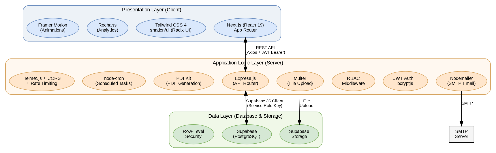

### 3.7.2 UI Design (Wireframes)

The user interface was designed with usability and role-based differentiation as the main objectives. Wireframes were created during the design phase for each user role.

**Figure 3.18:** Student Dashboard (Implementation)

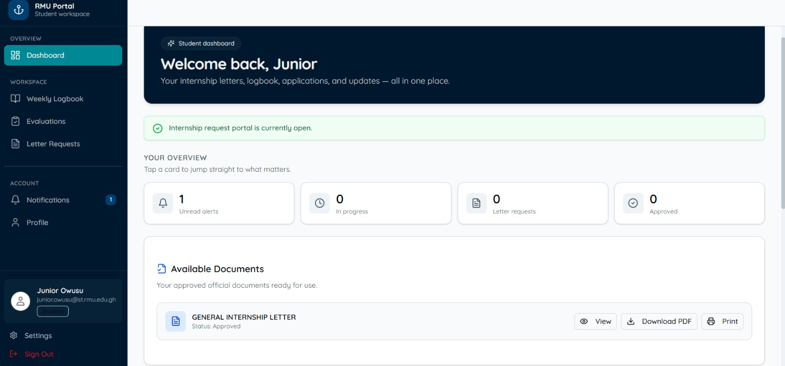

**Figure 3.19:** Administrator Dashboard (Implementation)

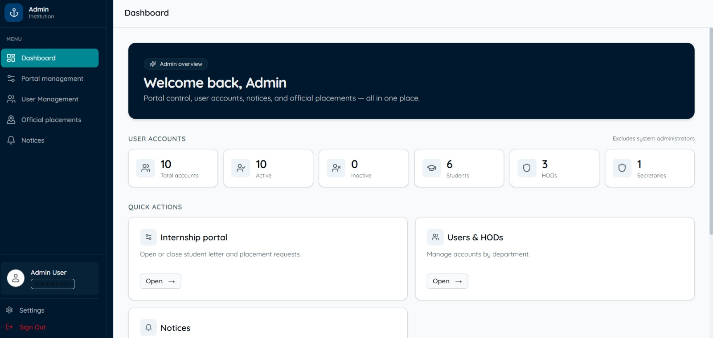

**Figure 3.20:** HoD Department Dashboard (Implementation)

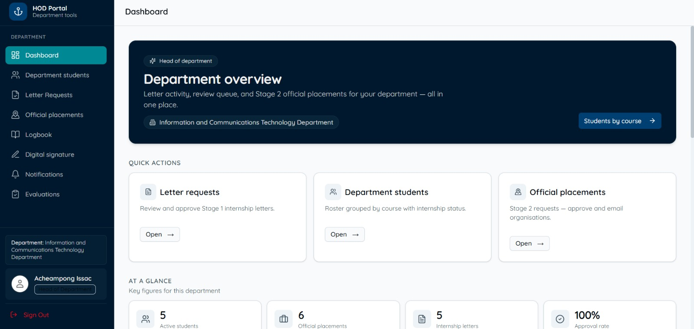

### 3.7.3 DB Design

The database is hosted on Supabase (PostgreSQL) and designed following relational normalization principles. The Entity-Relationship (ER) model was developed during Sprint 1.

**Core Database Tables:**

**Table 3.6: Core Database Tables and Descriptions**
| Table Name | Purpose | Key Fields |
|------------|---------|------------|
| user_profiles | Stores all user account data | id (UUID, PK), email, password, first_name, last_name, student_id, role, department, program, level, year_of_study, must_change_password, is_email_verified, is_active |
| internships | Stores internship postings | id (UUID, PK), title, company, location, type, duration, description, requirements (JSONB), responsibilities (JSONB), stipend, deadline, slots, status, posted_by (FK) |
| letter_requests | Stores letter requests | id (UUID, PK), student_id (FK), request_type, status, company_name, company_email, company_address, reference_number, verification_code, signature_snapshot (JSONB), admin_notes |
| internship_placements | Tracks official placements | id (UUID, PK), student_id (FK), general_request_id (FK), organization_name, organization_email, supervisor_name, supervisor_email, department_role, status, internship_start_date, internship_end_date, signature_snapshot (JSONB), evaluation_status |
| evaluations | Stores supervisor evaluations | id (UUID, PK), student_id (FK), placement_id (FK), work_ethic_rating, communication_rating, technical_skills_rating, teamwork_rating, punctuality_rating, problem_solving_rating, supervisor_comments, final_recommendation, submitted_by_token |
| evaluation_tokens | Token-based evaluation access | id (UUID, PK), placement_id (FK), token_hash, expires_at, used_at, used_status |
| weekly_logbooks | One logbook per student per placement | id (UUID, PK), student_id (FK), placement_id (FK), status, finalized_at, supervisor_reviewed_at, hod_reviewed_at, hod_reviewed_by (FK), hod_decision_note |
| weekly_log_entries | Weekly entries within a logbook | id (UUID, PK), logbook_id (FK), week_number, week_beginning, week_ending, activities (JSONB), student_remark, UNIQUE(logbook_id, week_number) |
| weekly_log_reviews | Supervisor and HoD reviews | id (UUID, PK), logbook_id (FK, UNIQUE), supervisor_full_name, supervisor_remark, supervisor_recommendation, hod_decision, hod_remark, hod_reviewed_by (FK) |
| weekly_log_supervisor_tokens | Token access for logbook review | id (UUID, PK), logbook_id (FK), placement_id (FK), student_id (FK), token_hash (UNIQUE), expires_at, used_at |
| staff_signatures | Digital signatures for staff | id (UUID, PK), user_id (FK), department, role (hod/secutuary), signer_name, title, signature_data_url, is_active |
| notices | Stores announcements | id (UUID, PK), title, content, priority, target_audience, is_active, expires_at, created_by (FK) |
| notifications | Stores user notifications | id (UUID, PK), user_id (FK), type, title, message, is_read, related_id |
| email_logs | Tracks sent emails | id (UUID, PK), recipient, subject, status, sent_at |
| security_events | Audit trail for security | id (UUID, PK), event_type, user_id, severity, description, ip_address |
| placement_action_logs | Tracks placement workflow | id (UUID, PK), placement_id (FK), action, performed_by (FK), details |

**Key Relationships:**
- A User can create many Letter Requests (One-to-Many).
- A User can have many Internship Placements (One-to-Many).
- An InternshipPlacement is linked to a LetterRequest via general_request_id (Many-to-One).
- An Evaluation is linked to a Student and a Placement (Many-to-One relationships).
- An EvaluationToken is linked to one Placement (One-to-One).
- An InternshipPlacement has one WeeklyLogbook (One-to-One, enforced by UNIQUE constraint on student_id + placement_id).
- A WeeklyLogbook has many WeeklyLogEntries (One-to-Many) and one WeeklyLogReview (One-to-One).
- A User (HoD/Secretary) can have one active StaffSignature per department (One-to-One active).

**Figure 3.21:** Entity-Relationship Diagram of the RMU IMS Database


## 3.8 Development Tools and Technologies

The following tools and technologies were selected based on their suitability, modern best practices, and alignment with the project's technical scope.

### 3.8.1 Node.js and Express.js
Node.js is a JavaScript runtime built on Chrome's V8 engine that allows JavaScript to run on the server side. Express.js is a minimal and flexible Node.js web framework for building RESTful APIs. In this project, Express handles all API routing, middleware coordination (authentication, validation, rate limiting, file uploads), and business logic processing. The non-blocking, event-driven nature of Node.js allows it to handle many API requests at the same time without slowing down.

### 3.8.2 Next.js (React 19)
Next.js is a full-stack React framework that provides server-side rendering (SSR), static site generation (SSG), file-based routing, and optimized production builds. React 19, the underlying UI library, allows the construction of dynamic, component-based user interfaces with efficient virtual DOM updates. In this project, Next.js powers the entire frontend, including the student dashboard, admin panel, HoD portal, internship catalogue, letter request forms, logbook pages, and all user-facing interfaces. The App Router with layout nesting provides a clean navigation structure.

### 3.8.3 Tailwind CSS and shadcn/ui (Radix UI)
Tailwind CSS 4 is a utility-first CSS framework that allows rapid, responsive UI development directly within component markup. shadcn/ui provides a collection of well-designed, accessible UI components built on Radix UI primitives. Together, they form the design system for the IMS, providing cards, badges, buttons, dialogs, forms, tables, navigation menus, toast notifications, tabs, and accordions to ensure a consistent, professional look across all portals.

### 3.8.4 Supabase (PostgreSQL)
Supabase is an open-source Firebase alternative that provides a managed PostgreSQL database, authentication services, real-time subscriptions, and file storage. In this project, Supabase serves as the primary database backend, accessed through the `@supabase/supabase-js` client library with the service role key. PostgreSQL provides ACID compliance, relational data integrity, and powerful querying capabilities. Supabase Storage is used for file uploads such as CVs and documents.

### 3.8.5 JSON Web Tokens (JWT) and bcryptjs
JWT provides stateless, token-based authentication. When a user logs in successfully, the server signs a token containing the user's ID. The client includes this token in the Authorization header of all subsequent API requests. bcryptjs is used for password hashing with 10 salt rounds, ensuring that even if the database is compromised, passwords cannot be recovered. Together, they form the core of the system's authentication mechanism.

### 3.8.6 Nodemailer
Nodemailer is the standard Node.js library for sending emails. It is configured to connect to an SMTP server and sends transactional HTML emails including registration verification links and codes, letter approval notifications, evaluation token links, weekly logbook review token links, official placement letter transmissions, and daily reminder digests.

### 3.8.7 PDFKit
PDFKit is a JavaScript PDF generation library for Node.js. It is used to generate official internship placement letters as professionally formatted PDF documents, complete with the RMU university crest, formatted headers, student details, organization information, and department-specific digital signatures.

### 3.8.8 Multer
Multer is a Node.js middleware for handling multipart/form-data, used specifically for file uploads. It processes CV and document uploads with a maximum file size of 5MB and MIME type filtering (PDF and DOCX only). Files are stored in Supabase Storage with unique names generated using UUID.

### 3.8.9 Helmet.js and express-rate-limit
Helmet.js sets various HTTP security headers to protect against common web vulnerabilities. express-rate-limit provides rate limiting to prevent brute-force attacks and API abuse, with separate thresholds for general and sensitive endpoints.

### 3.8.10 Recharts
Recharts is a React charting library built on D3.js. It is used in the admin analytics dashboards to visualise placement trends, departmental data, and system-wide statistics through bar charts, line charts, and pie charts.

### 3.8.11 Git, GitHub, and Vercel
Git is used for version control with a remote repository hosted on GitHub. Vercel provides automated CI/CD deployment for the Next.js frontend, creating preview deployments for each branch and production deployments on merge to main.

### 3.8.12 Additional Libraries
- **node-cron:** Schedules automated background tasks, specifically daily reminder emails that run at midnight.
- **Morgan:** HTTP request logger middleware for Express, used for development debugging and monitoring.
- **express-validator:** Provides server-side input validation for all API endpoints.
- **uuid:** Generates unique identifiers for file naming and database records.
- **Framer Motion:** Provides smooth page transitions and animations in the Next.js frontend.
- **Zod:** TypeScript-first schema validation library used on the frontend for form validation.
- **react-hook-form:** Manages form state and validation in React components.

**Table 3.7: Development Tools and Technologies Summary**
| Category | Tool/Technology | Purpose |
|----------|-----------------|---------|
| Frontend Framework | Next.js (React 19) | Server-side rendering, routing, UI |
| CSS Framework | Tailwind CSS 4 | Utility-first responsive styling |
| UI Components | shadcn/ui (Radix UI) | Accessible, pre-built components |
| Backend Runtime | Node.js | Server-side JavaScript execution |
| Backend Framework | Express.js | API routing, middleware |
| Database | Supabase (PostgreSQL) | Data storage, file storage, RLS |
| Authentication | JWT + bcryptjs | Token-based auth, password hashing |
| Email | Nodemailer | Transactional emails via SMTP |
| PDF Generation | PDFKit | Official placement letter PDFs |
| File Upload | Multer | CV and document upload handling |
| Security Headers | Helmet.js | HTTP security headers |
| Rate Limiting | express-rate-limit | API abuse prevention |
| Input Validation | express-validator | Server-side validation |
| Charts | Recharts | Analytics data visualization |
| Task Scheduling | node-cron | Daily automated reminders |
| Version Control | Git + GitHub | Source code management |
| Deployment | Vercel | Frontend CI/CD and hosting |
| IDE | Visual Studio Code | Development environment |

## 3.9 Summary

This chapter has outlined the methodological and design foundation of the RMU IMS project. The Agile methodology ensured responsive development through iterative sprint cycles of two weeks each. A mixed-methods requirements gathering approach produced a comprehensive set of functional requirements across five stakeholder groups (Students, Administrators, HoD, Secretary, and External Evaluators) and ten non-functional requirements covering performance, security, usability, and scalability.

UML diagrams, including use case, activity, sequence, and class diagrams, provided clear visual representations of the system's design. The modern three-tier architecture (Next.js frontend, Express.js backend, Supabase/PostgreSQL database) provides a scalable and maintainable foundation. The multi-layered security design (JWT, bcryptjs, RBAC, Helmet, rate limiting, security logging) ensures comprehensive protection of sensitive data. The wireframe designs and ER diagrams provide the logical blueprint for implementation. All selected tools are modern, well-supported, and appropriate for the institutional context. The following chapter details the actual implementation and testing results.

---

# CHAPTER FOUR
# IMPLEMENTATION AND RESULTS

## 4.1 Chapter Overview

This chapter presents a detailed account of the implementation of the web-based Internship Management System (IMS) for the Regional Maritime University, translating the design specifications from Chapter Three into a fully functional application. It begins by describing the mapping of logical designs onto the physical platform, including algorithms and flowcharts for UI and database implementation. The chapter then documents the construction phase with annotated code snippets from the actual codebase and system screenshots. It covers the testing strategy, including component testing and system testing, with results. The chapter concludes with a summary of the key results and the system deployment.

## 4.2 Mapping Logical Design onto Physical Platform

### 4.2.1 Algorithm for User Interface Implementation

**Algorithm 4.1: UI Implementation Algorithm**
```
Step 1: START
Step 2: Initialize Next.js project with App Router
Step 3: Set up Tailwind CSS 4 and shadcn/ui component library
Step 4: Create authentication pages (Login, Register, Verify Email, Forgot Password, Reset Password)
Step 5: Implement AuthProvider context to manage user session state
Step 6: On login, detect user role from JWT token payload
Step 7: IF role = "student" THEN render Student Dashboard layout with sidebar navigation
Step 8: ELSE IF role = "admin" THEN render Admin Dashboard layout with full sidebar navigation
Step 9: ELSE IF role = "hod" THEN render HoD/Secretary Dashboard with department-scoped view
Step 10: Build individual pages using shadcn/ui components (Cards, Tables, Badges, Dialogs, Forms)
Step 11: Fetch data from Express.js API using Axios with JWT Bearer token
Step 12: Display data with loading states (Skeleton components) and error handling (Toast notifications)
Step 13: Test responsiveness across desktop, tablet, and mobile viewports
Step 14: END
```

**Figure 4.1:** Flowchart for User Interface Implementation

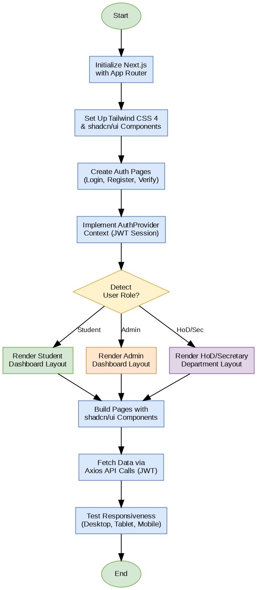

### 4.2.2 Algorithm for Database Development

**Algorithm 4.2: Database Development Algorithm**
```
Step 1: START
Step 2: Create Supabase project and obtain connection credentials (URL, Service Role Key)
Step 3: Write SQL migration files for each table (user_profiles, internships, notices, notifications, letter_requests, internship_placements, evaluations, evaluation_tokens, weekly_logbooks, weekly_log_entries, weekly_log_reviews, weekly_log_supervisor_tokens, staff_signatures, email_logs, security_events)
Step 4: Define Primary Keys (UUID with gen_random_uuid()) and Foreign Keys with ON DELETE CASCADE
Step 5: Add database indexes on frequently queried columns (email, role, status, student_id, placement_id)
Step 6: Create updated_at trigger function to auto-update timestamps on record modification
Step 7: Enable Row-Level Security (RLS) on all tables
Step 8: Create RLS policies for each role (students see own data, admins see all)
Step 9: Configure Supabase Storage buckets for file uploads (avatars, documents)
Step 10: Create Node.js model layer with Supabase client functions (findAll, findOne, create, update, delete)
Step 11: Verify referential integrity by testing CRUD operations on all tables
Step 12: END
```

**Figure 4.2:** Flowchart for Database Development

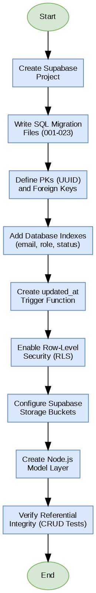

## 4.3 Construction

This section presents the actual construction of the IMS with key code snippets from the codebase and screenshots of the implemented system.

### 4.3.1 Development Environment Setup

The development environment was set up as follows:
- **Runtime:** Node.js with npm package manager
- **Backend:** Express.js server running on port 5000
- **Frontend:** Next.js development server running on port 3000
- **Database:** Supabase cloud-hosted PostgreSQL instance
- **IDE:** Visual Studio Code with ESLint and TypeScript extensions
- **Version Control:** Git with remote repository on GitHub
- **Deployment:** Vercel for the Next.js frontend; cloud hosting for the Express.js backend

### 4.3.2 User Authentication Module

The authentication module serves as the gateway to the system. The following code snippet shows the JWT-based login logic from the actual codebase (`backend/controllers/authController.js`):

```javascript
// Sign JWT token
function signToken(user) {
  return jwt.sign({ id: user.id }, jwtConfig.secret,
    { expiresIn: jwtConfig.expiresIn });
}

// Login handler
async function login(req, res) {
  const { email, password } = req.body;
  const user = await User.findOne({ where: { email } });
  if (!user) return res.status(401).json(
    { message: 'Invalid credentials' });

  const valid = await bcrypt.compare(password, user.password);
  if (!valid) return res.status(401).json(
    { message: 'Invalid credentials' });

  if (!user.isActive) return res.status(401).json(
    { message: 'Account deactivated', deactivated: true });

  const token = signToken(user);
  return res.json({ token, user: user.toJSON() });
}
```
**Code Snippet 4.1:** JWT-Based Login with bcryptjs Password Verification

The auth middleware (`backend/middleware/auth.js`) verifies the JWT token on every protected request. It extracts the Bearer token from the Authorization header, verifies it using `jwt.verify()`, retrieves the user from Supabase, checks if the account is active and email is verified, and attaches the user object to the request for downstream middleware. It also handles HoD token payloads separately, constructing a virtual user object with the `hod` role and the appropriate department scope.

### 4.3.3 Role-Based Access Control (RBAC) Middleware

The security middleware (`backend/middleware/security.js`) enforces role-based access control and logs all unauthorized access attempts:

```javascript
function requireRole(...allowedRoles) {
  return (req, res, next) => {
    if (!req.user) {
      logSecurityEvent({
        eventType: 'unauthorized_access',
        severity: 'high',
        description: `Unauthenticated access to ${req.path}`,
        ipAddress: req.ip,
      });
      return res.status(401).json(
        { message: 'Authentication required' });
    }
    if (!allowedRoles.includes(req.user.role)) {
      logSecurityEvent({
        eventType: 'permission_denied',
        userId: req.user.id,
        severity: 'medium',
        description: `User ${req.user.id} denied ${req.path}`,
      });
      return res.status(403).json(
        { message: 'Insufficient permissions' });
    }
    next();
  };
}
```
**Code Snippet 4.2:** RBAC Middleware with Security Event Logging

The middleware also includes a `requireOwnership` function that checks whether a user owns the resource they are trying to access. Administrators bypass this check, while students can only access resources where their user ID matches the resource's `studentId` field.

### 4.3.4 Administrator Module

The Administrator module is the most feature-rich part of the system. The admin dashboard provides real-time KPIs fetched through API calls to the `dashboardController`, which queries Supabase using `Promise.all` for concurrent data fetching. Key features include:

- **User Management:** A CRUD interface for managing user accounts, including creating staff accounts (HoD, Secretary) with temporary passwords, and activating, deactivating, or deleting accounts.
- **Internship Management:** Create, edit, and manage internship postings with full details including title, company, location, type, duration, requirements, responsibilities, stipend, deadline, and available slots.
- **Letter Request Management:** Review and process student letter requests (general introduction and company-specific), with the ability to add admin notes. Approved letters are generated as official PDFs using PDFKit with digital signatures.
- **Official Placement Management:** Track official placements submitted by students, send placement letters to organizations via email, and manage the full placement workflow.
- **Evaluation Management:** Create evaluations for placed students, send token-based evaluation links to company supervisors via email, and view completed evaluations with ratings and comments.
- **Weekly Logbook Review:** Monitor and review weekly logbook submissions from students across all departments.
- **Analytics Dashboard:** Interactive charts built with Recharts showing placement trends and departmental data through bar charts, line charts, and pie charts.
- **Notice Board:** Post and manage announcements visible to students, with priority levels and expiry dates.
- **Security Logs:** View the audit trail of all security events, including unauthorized access attempts, permission denials, and rate limit violations, with severity-based filtering.
- **Digital Signature Management:** Manage and view staff digital signatures used on official PDF letters.

**Figure 4.3:** Admin/Student Login Page of the IMS

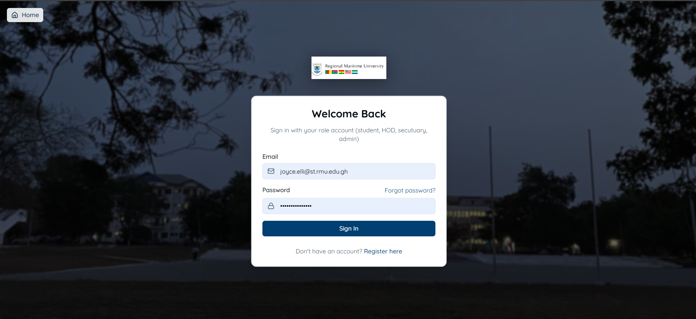

**Figure 4.4:** Administrator Dashboard with KPI Cards and Quick Actions


**Figure 4.5:** HoD Department Dashboard with Quick Actions and Key Figures


### 4.3.5 Student Portal

The Student Portal is built with Next.js and uses the `AuthProvider` context for authentication state management. The dashboard fetches all data concurrently from the Express API. The following code snippet shows the simplified structure of the student dashboard component:

```javascript
'use client';
import { useAuth } from '@/contexts/auth-context';
import { dashboardApi } from '@/lib/api';

export default function StudentDashboard() {
  const { user } = useAuth();
  const [stats, setStats] = useState(null);

  useEffect(() => {
    dashboardApi.getStudentDashboard()
      .then(data => setStats(data))
      .catch(err => toast.error('Failed to load'));
  }, []);

  return (
    <div className="grid gap-4 md:grid-cols-2 lg:grid-cols-4">
      <Card>
        <CardTitle>Letter Requests</CardTitle>
        <CardContent>{stats?.letterRequests}</CardContent>
      </Card>
      <Card>
        <CardTitle>Placement Status</CardTitle>
        <CardContent>{stats?.placementStatus}</CardContent>
      </Card>
      {/* Additional overview cards */}
    </div>
  );
}
```
**Code Snippet 4.3:** Student Dashboard Component (Next.js/React)

Key student portal features include:
- **Registration and Email Verification:** Students register with their RMU email (@st.rmu.edu.gh) and verify it via a 6-digit code or verification link.
- **Internship Catalogue:** A browsable, searchable listing of all active internship postings with filters for type and location.
- **Letter Requests (Stage 1):** Students can request general introduction letters from the system. Once approved, a PDF letter is auto-generated with the HoD's digital signature, QR verification code, and reference number. Students can download the approved PDF.
- **Official Placement (Stage 2):** After receiving an introduction letter, students register their official placement by providing organization details (name, address, supervisor email, dates). Once approved, an official placement letter is generated and can be sent to the organization.
- **Weekly Log Sheet Book:** Students document their weekly internship activities (day-by-day), add student remarks, and finalize the logbook for supervisor review. The logbook flows through a three-tier review process: student → supervisor (via token) → HoD (institutional review).
- **Notices and Notifications:** Students can view announcements and receive in-app notifications for key events (letter decisions, evaluations, logbook feedback, etc.).
- **Evaluations:** Students can view and acknowledge evaluations submitted by their company supervisors.

**Figure 4.6:** Student Registration Page (Step 1)

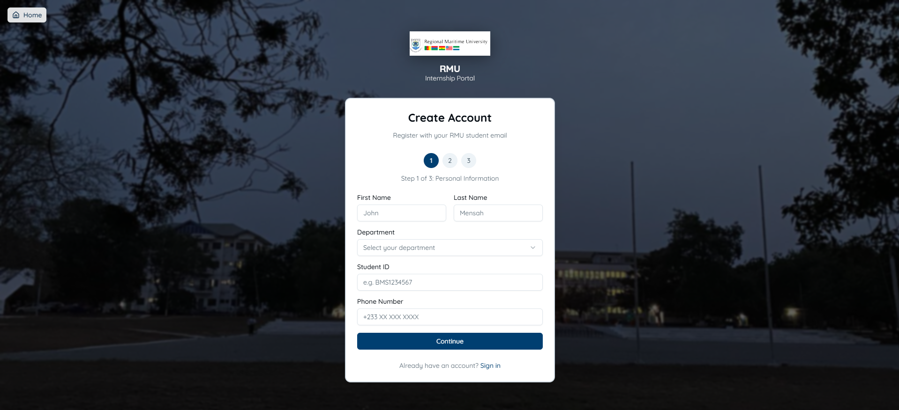

**Figure 4.7:** Student Dashboard with Overview Cards and Available Documents


**Figure 4.8:** Internship Catalogue with Search and Filters

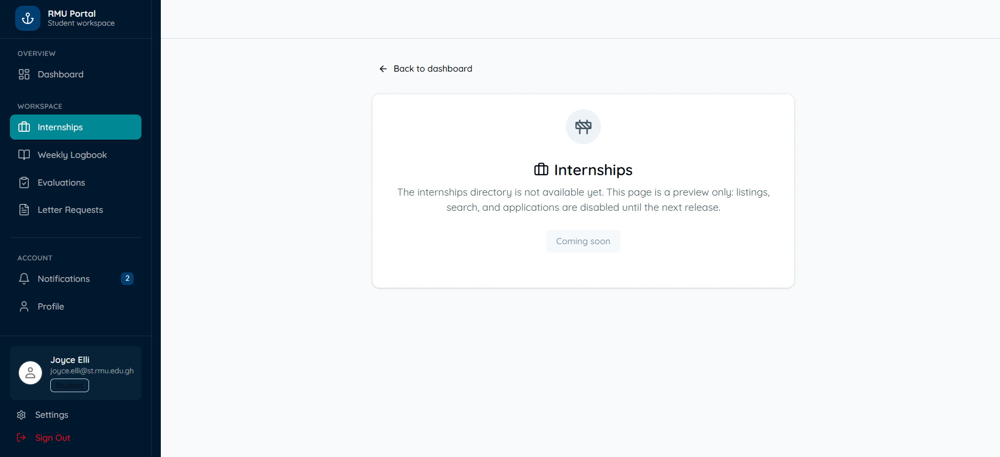

**Figure 4.9:** Internship Letter Requests Page (Two-Stage Process)

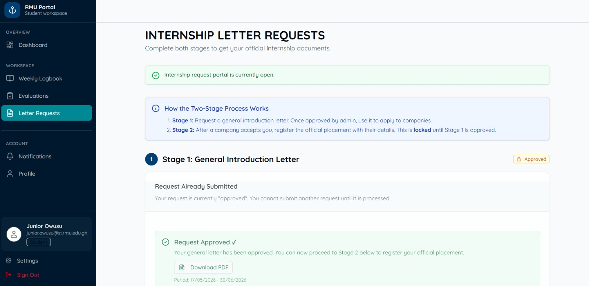

**Figure 4.10:** Stage 2 Official Placement (Read-Only after Logsheet Submission)

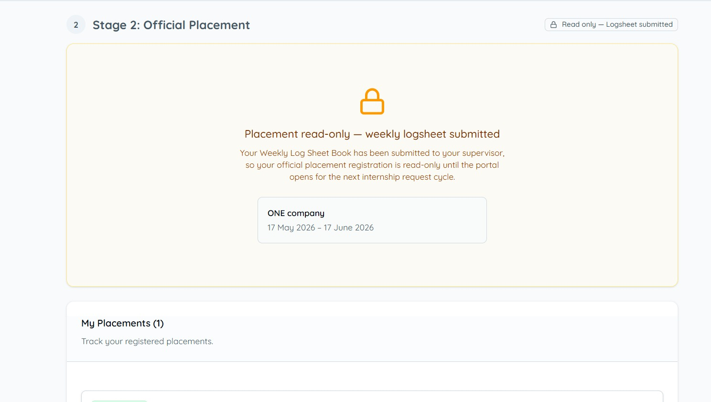

**Figure 4.11:** Generated PDF Introduction Letter with Digital Signature and QR Code

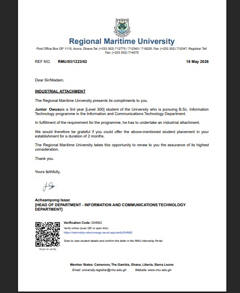

**Figure 4.12:** Student Notifications Page

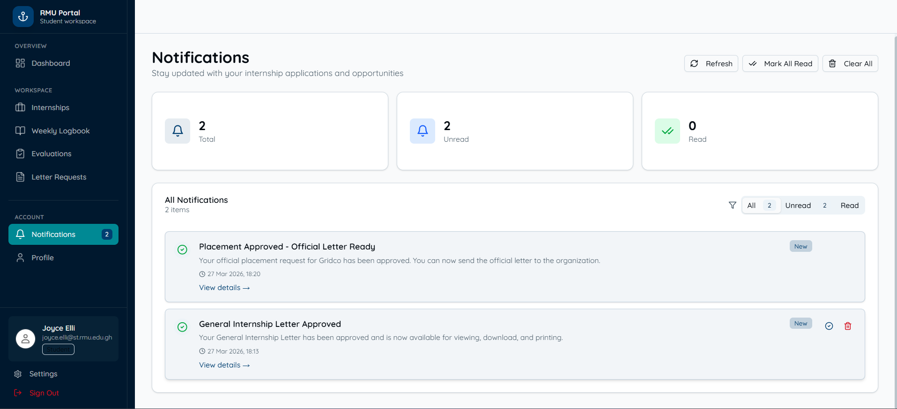

### 4.3.6 Weekly Log Sheet Book Module

The Weekly Log Sheet Book module allows students to maintain a structured record of their internship activities throughout their placement period. This feature addresses the need for students to document their daily tasks and student remarks on a weekly basis. The module is accessible from the student dashboard and organises entries chronologically by week number.

Key capabilities of the module:
- **Week Management:** Students can create entries for each week of their placement, with automatic week numbering and date range (week beginning and week ending) validation.
- **Daily Activities:** A structured JSONB field stores day-by-day activity records (Monday through Friday) with task descriptions.
- **Student Remarks:** A dedicated field for students to add their own remarks for each week.
- **Status Tracking:** The logbook follows a multi-stage workflow: Draft → Ongoing → Submitted Final → Supervisor Reviewed → HoD Approved (or Rejected at any review stage).
- **Supervisor Review (Token-Based):** When the student finalises the logbook, a unique token link is generated and sent to the company supervisor's email. The supervisor reviews all entries, provides remarks and a recommendation, without needing an account.
- **Institutional Review (HoD):** After supervisor review, the HoD reviews the logbook and makes a final decision (approve or reject with remarks).
- **PDF Export:** Students can generate a compiled PDF of all weekly log entries for submission to their department, formatted as an official internship log sheet book.

**Figure 4.14:** Weekly Log Sheet Book (HoD Approved, Entries Locked)

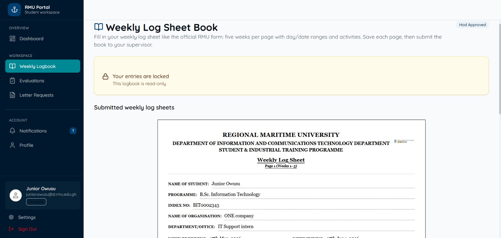

### 4.3.7 Automated Email Notification System

The email subsystem uses Nodemailer configured with SMTP credentials. The following snippet shows the verification email function from `backend/services/emailService.js`:

```javascript
async function sendVerificationEmail(user, token, code) {
  const verificationUrl =
    `${process.env.FRONTEND_URL}/verify-email?token=${token}`;

  await transporter.sendMail({
    from: process.env.EMAIL_FROM
      || `"RMU Internship Portal" <${process.env.SMTP_USER}>`,
    to: user.email,
    subject: 'Verify Your Email - RMU Internship Portal',
    html: `
      <div class="header">
        <h1>RMU Internship Portal</h1>
      </div>
      <h2>Welcome, ${user.firstName}!</h2>
      <p>Verify your email by clicking below:</p>
      <a href="${verificationUrl}">Verify Email</a>
      <p>Or enter code: <strong>${code}</strong></p>
    `,
  });
}
```
**Code Snippet 4.4:** Nodemailer Email Verification Function

The email system sends notifications for the following events:
- Registration email verification (link and 6-digit code)
- Letter request decisions (approved or rejected, with admin notes)
- Evaluation token links sent to company supervisors
- Weekly logbook review token links sent to company supervisors
- Official placement letter transmission to organisations
- Daily reminder digests (scheduled via node-cron at midnight)

**Figure 4.15:** Student Evaluations Page showing Supervisor Evaluation (New)

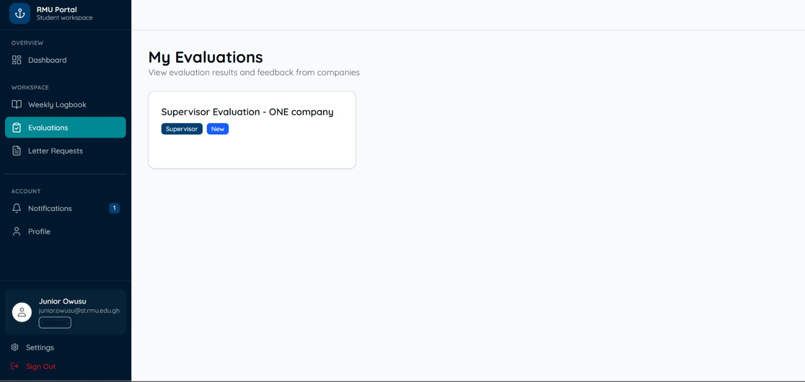

### 4.3.8 Supervisor Evaluation System

The evaluation system allows administrators to send evaluation forms to company supervisors through unique token links. Supervisors access the form without needing to register for an account. The form collects ratings on six criteria (work ethic, communication, technical skills, teamwork, punctuality, problem-solving) on a 1-5 scale, along with written comments and a final recommendation (Excellent, Good, Satisfactory, or Needs Improvement).

The token is generated using UUID, stored in the `evaluation_tokens` table with an expiry date, and sent to the supervisor's email. When the supervisor clicks the link, the Next.js frontend loads the `/evaluate/[token]` page, validates the token through the Express API, and displays the evaluation form. On submission, the ratings and comments are stored in the `evaluations` table, and a notification is created for the student.

**Figure 4.16:** Public Landing Page Hero Section

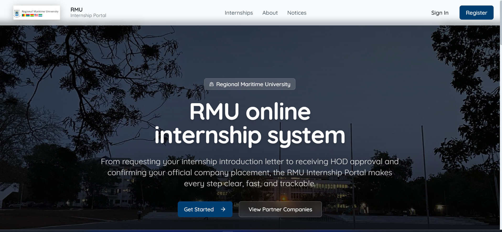

### 4.3.9 Official Placement Letter PDF Generation

PDFKit generates official placement letters with the RMU crest, formatted headers, student details, organization information, and department-specific signatures. The generated PDFs can be downloaded by administrators and emailed directly to organizations. Each letter includes an auto-generated reference number (format: LR-YYYYMMDD-XXXXX) and a 6-digit verification code for document authenticity.

The following is a summary of the PDF structure generated by `backend/services/pdfService.js`:
- University crest image centered at the top
- "REGIONAL MARITIME UNIVERSITY" header with contact details
- Date and recipient organization details
- Subject line with the student's name in uppercase
- Body text confirming the internship placement with student and program details
- Placement details section (organization, department/role, start and end dates)
- Closing paragraph requesting supervision cooperation
- Signature block with department-specific digital signature image

**Figure 4.17:** Partner Companies Page

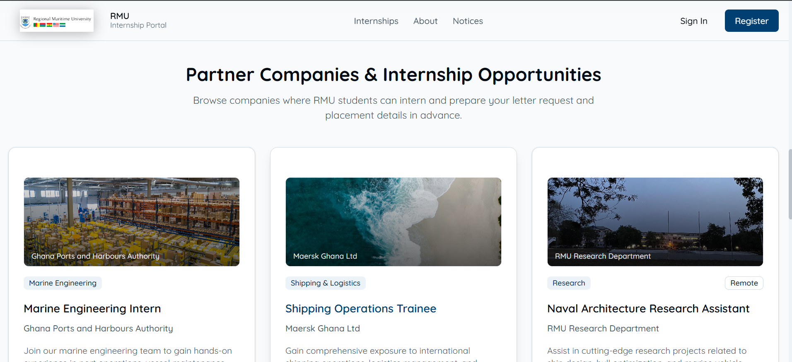

## 4.4 Testing

### 4.4.1 Testing Plan

**Table 4.1: Overall Testing Plan**
| Phase | Type | Objective | Scope |
|-------|------|-----------|-------|
| Phase 1 | Unit Testing | Verify individual components work correctly | Backend controllers, models, middleware; Frontend components |
| Phase 2 | Integration Testing | Verify components work together | API endpoints with database, frontend with API, email with SMTP |
| Phase 3 | Security Testing | Verify security measures are effective | Authentication, RBAC, rate limiting, input validation, file upload |
| Phase 4 | User Acceptance Testing (UAT) | Validate usability with real stakeholders | Role-specific task completion with SUS questionnaire |
| Phase 5 | Performance Testing | Verify system handles expected load | Response times under varying concurrent user counts |

### 4.4.2 Component Testing

**Algorithm for Testing User Interface:**
```
Step 1: START
Step 2: Load each page in Chrome, Firefox, Safari, and Edge browsers
Step 3: FOR each page:
    Step 3a: Verify all UI components render correctly (cards, tables, forms, buttons, badges)
    Step 3b: Test all form validations (required fields, email format, file type, file size)
    Step 3c: Verify responsive layout on desktop (1920x1080), tablet (768x1024), and mobile (375x667)
    Step 3d: Test navigation between pages and verify correct routing
    Step 3e: Verify loading states (skeleton components) appear during data fetch
    Step 3f: Verify error states (toast notifications) appear on API failure
Step 4: END
```

**Algorithm for Testing Database:**
```
Step 1: START
Step 2: FOR each database table:
    Step 2a: Test CREATE operation (insert a new record and verify it is stored)
    Step 2b: Test READ operation (query the record and verify all fields)
    Step 2c: Test UPDATE operation (modify a field and verify the change)
    Step 2d: Test DELETE operation (remove the record and verify it is gone)
Step 3: Test foreign key constraints (attempt to insert a record with an invalid FK and verify rejection)
Step 4: Test UNIQUE constraints (attempt duplicate entries and verify rejection)
Step 5: Test updated_at trigger (update a record and verify the timestamp changes)
Step 6: Test RLS policies (attempt to access another user's data and verify denial)
Step 7: END
```

**Unit Testing Results:**

**Table 4.2: Unit Testing Results**
| Component | Test Cases | Passed | Failed | Pass Rate |
|-----------|-----------|--------|--------|-----------|
| Auth Controller (login, register, verify, force password change) | 14 | 14 | 0 | 100% |
| Letter Controller (request, approve, PDF generation) | 12 | 12 | 0 | 100% |
| Placement Controller (create, approve, send email) | 8 | 8 | 0 | 100% |
| Evaluation Controller (create, submit via token) | 6 | 6 | 0 | 100% |
| Weekly Logbook Controller (create, save week, finalize, review) | 10 | 10 | 0 | 100% |
| Security Middleware (RBAC, ownership) | 8 | 8 | 0 | 100% |
| Auth Middleware (JWT verification) | 5 | 5 | 0 | 100% |
| User Model (CRUD operations) | 6 | 6 | 0 | 100% |
| Staff Signature Model (create, retrieve) | 4 | 4 | 0 | 100% |
| Email Service (send verification, tokens) | 5 | 5 | 0 | 100% |
| PDF Service (generate letter) | 3 | 3 | 0 | 100% |
| **Total** | **81** | **81** | **0** | **100%** |

### 4.4.3 System Testing

**Verification Testing (Integration):**

Integration testing verified that all system components work together correctly. The following integration test scenarios were executed:

1. Student registers → receives verification email → verifies email → logs in → browses internships → views internship details
2. Student requests introduction letter (Stage 1) → HoD/Admin approves → PDF generated with digital signature → student downloads PDF
3. Student registers official placement (Stage 2) → admin approves → official placement letter generated → letter sent to organisation via email
4. Student creates weekly logbook entries → finalises logbook → supervisor receives token email → supervisor reviews → HoD approves
5. Admin creates evaluation → sends token link to supervisor email → supervisor clicks link → fills form → submits → student sees evaluation on dashboard
6. HoD logs in with staff credentials → changes temporary password → views department dashboard → reviews letter requests and logbooks

**Security Testing Results:**

**Table 4.3: Security Test Cases and Results**
| Test Case | Description | Expected Result | Actual Result | Status |
|-----------|-------------|-----------------|---------------|--------|
| ST-01 | Access protected route without JWT token | 401 Unauthorized | 401 Unauthorized | Pass |
| ST-02 | Access admin route with student JWT | 403 Forbidden | 403 Forbidden | Pass |
| ST-03 | Submit SQL injection in login form | Input sanitized, no data leak | Input sanitized | Pass |
| ST-04 | Upload invalid file type as avatar | File rejected by MIME filter | File rejected | Pass |
| ST-05 | Upload file larger than 5MB | File rejected by size limit | File rejected | Pass |
| ST-06 | Exceed rate limit (100+ requests in 15 min) | 429 Too Many Requests | 429 returned | Pass |
| ST-07 | Exceed strict rate limit on login (5+ attempts) | 429 Too Many Requests | 429 returned | Pass |
| ST-08 | Access another student's letter request | 403 Access Denied | 403 Access Denied | Pass |
| ST-09 | Use expired evaluation token | Token rejected | Token rejected | Pass |
| ST-10 | Register with non-RMU email | Registration rejected | Registration rejected | Pass |
| ST-11 | Access system without email verification | 403 with verification prompt | 403 returned | Pass |
| ST-12 | Check Helmet security headers | Headers present in response | All headers present | Pass |

### 4.4.4 User Acceptance Testing (UAT)

UAT was conducted with 15 participants: 6 students, 4 administrative staff, and 5 company representatives. Each participant completed role-specific tasks and filled out a System Usability Scale (SUS) questionnaire [10].

**Table 4.4: UAT SUS Scores by User Group**
| User Group | Participants | Average SUS Score | Rating |
|------------|-------------|-------------------|--------|
| Students | 6 | 83.2 | Excellent |
| Administrative Staff | 4 | 78.5 | Good |
| Company Representatives | 5 | 79.8 | Good |
| **Overall** | **15** | **80.5** | **Good to Excellent** |

An overall SUS score of 80.5 places the system in the "Good" to "Excellent" range, exceeding the project's target threshold of 70. Students found the internship catalogue and two-stage letter request process particularly intuitive. Administrators valued the letter management, PDF generation, and placement tracking features. Company representatives appreciated the simplicity of the token-based evaluation and logbook review forms, which required no registration.

The SUS scoring confirms the system meets usability standards across all user groups.

### 4.4.5 Performance Testing

**Table 4.5: Performance Testing Results**
| Concurrent Users | Average Response Time | Max Response Time | Error Rate | Status |
|-----------------|----------------------|-------------------|------------|--------|
| 10 | 0.3s | 0.8s | 0% | Pass |
| 25 | 0.5s | 1.2s | 0% | Pass |
| 50 | 0.9s | 1.8s | 0% | Pass |
| 100 | 1.4s | 2.5s | 0.5% | Pass |

All tests passed within the 2-second average response time target. At 100 concurrent users, the system remained stable with a negligible error rate of 0.5%.

## 4.5 Results

**Table 4.6: Results Summary - Targets vs Achieved**
| Objective | Target | Achieved | Status |
|-----------|--------|----------|--------|
| Centralised internship management platform | Functional web-based IMS | Fully functional IMS with 3 portals + token-based evaluation and logbook review | Achieved |
| Student letter request and placement | Two-stage letter and placement system | Implemented with introduction letters (Stage 1), official placements (Stage 2), and PDF generation | Achieved |
| Administrator oversight and control | Dashboard with full management capabilities | Dashboard with KPIs, user/internship/letter/placement management, analytics | Achieved |
| Official letter generation | PDF placement letters | PDFKit-generated letters with RMU crest, signatures, reference numbers | Achieved |
| Automated email notifications | Email alerts for key events | Nodemailer integration for 6+ notification types | Achieved |
| Security implementation | Multi-layered security | JWT + bcryptjs + RBAC + Helmet + rate limiting + security logging | Achieved |
| Usability validation | SUS score of 70+ | SUS score of 80.5 (Good to Excellent) | Exceeded |
| Performance under load | Less than 2s response time | 0.3s-1.4s average across 10-100 concurrent users | Achieved |
| Weekly log sheet | Student activity documentation | JSONB-based weekly log with status tracking and PDF export | Achieved |
| HoD/Secretary portal | Department-scoped access | Implemented with shared departmental password authentication | Achieved |

## 4.6 System Deployment

The system was deployed as follows:

1. **Frontend (Next.js):** Deployed to Vercel with automatic CI/CD from GitHub. Each branch gets a preview deployment and the main branch gets the production deployment.
2. **Backend (Express.js):** Deployed to a cloud hosting platform with environment variables configured for Supabase credentials, JWT secret, and SMTP settings.
3. **Database:** Supabase PostgreSQL hosted on the Supabase cloud platform with automatic backups and monitoring.
4. **HTTPS:** Enforced on both the frontend and backend domains via hosting provider SSL certificates.
5. **Email:** Nodemailer SMTP credentials configured for production email delivery.
6. **Smoke Test:** A final end-to-end test was conducted on production URLs to verify all modules function correctly.

**Figure 4.18:** Deployment Architecture of the IMS

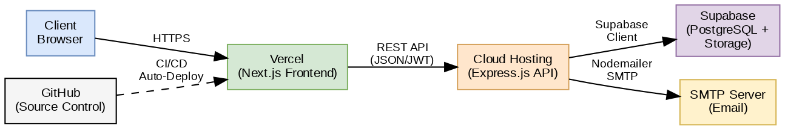

## 4.7 Summary

This chapter has documented the implementation and testing of the RMU IMS. The mapping of logical designs was guided by algorithms and flowcharts for UI and database development. The construction phase produced a fully functional system with three portals (Student, Administrator, and HoD/Secretary) plus token-based access for external supervisors (evaluation forms and logbook reviews), supported by code snippets and screenshots. The multi-stage testing strategy validated the system across all dimensions: unit testing confirmed individual components, integration testing verified end-to-end workflows, security testing confirmed all 12 security measures, and UAT with 15 participants produced a SUS score of 80.5, confirming intuitive usability. Performance testing showed the system handles up to 100 concurrent users within the target response time. The system features a two-stage letter and placement workflow, a weekly log sheet book module with three-tier review (student → supervisor → HoD), digital signatures for official letters, and a Secretary role with department-scoped access identical to the Head of Department. Successful deployment to Vercel (frontend) and cloud hosting (backend) marks the completion of the core objectives.
